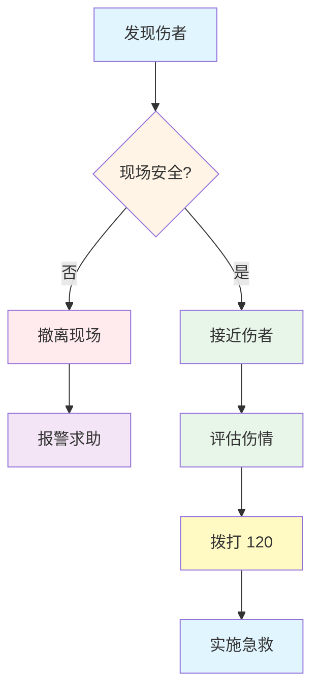

# 现场处置原则 🚨

现场急救的 SOP（标准操作流程）

---
layout: two-cols
layoutClass: gap-8
---

# 现场评估 5 步法

<v-clicks>

### 📋 第一步：观察环境

- 🔥 是否有火灾、爆炸风险？
- ⚡ 是否有漏电危险？
- 🚗 是否有交通隐患？
- 🏗️ 是否有坍塌风险？

💡 安全第一！如果现场危险，先撤离再报警

### 📞 第二步：呼叫援助

- 📱 拨打 **120**
- 🗣️ 清晰说明：位置、伤情、人数
- 👥 指定专人接应救护车

</v-clicks>

::right::

决策流程图：遇到紧急情况该怎么办？

---
layout: default
---

# 现场评估 5 步法（续）

<v-clicks>

### 🩺 第三步：快速评估伤情

使用 **ABC 原则** 评估：

  
💨

  <strong>A - Airway</strong>
  
气道是否通畅？

  
🫁

  <strong>B - Breathing</strong>
  
是否有呼吸？

  
❤️

  <strong>C - Circulation</strong>
  
是否有脉搏/大出血？

### 🎯 第四步：优先处理致命伤

  <strong class="text-red-700">🚨 立即处理</strong>
  <ul class="text-sm mt-2 space-y-1">
    <li>• 大出血</li>
    <li>• 呼吸/心跳停止</li>
    <li>• 气道梗阻</li>
  </ul>

  <strong class="text-yellow-700">⚠️ 尽快处理</strong>
  <ul class="text-sm mt-2 space-y-1">
    <li>• 骨折</li>
    <li>• 中等出血</li>
    <li>• 烧伤</li>
  </ul>

  <strong class="text-green-700">✅ 可以等待</strong>
  <ul class="text-sm mt-2 space-y-1">
    <li>• 轻微擦伤</li>
    <li>• 小伤口</li>
    <li>• 轻度扭伤</li>
  </ul>

### 🛡️ 第五步：持续监测

- 👀 观察伤者意识状态
- 🫁 注意呼吸变化
- 🤒 保持伤者体温
- 💬 安抚伤者情绪

</v-clicks>

---
transition: fade
---

# 现场处置的黄金时间 ⏱️

<v-clicks>

  
⏰ 4-6 分钟

  

    心跳骤停的黄金抢救时间
  

  

    超过这个时间，大脑可能出现不可逆损伤
  

  
🩸 1-2 小时

  <strong>严重出血的处理时限</strong>
  
大量失血可能导致休克

  
❄️ 6-8 小时

  <strong>断肢的保存时限</strong>
  
妥善保存可延长再植成功率

</v-clicks>

💡 记住：时间就是生命！ 别犹豫，该动手时就动手！

---
layout: center
class: text-center
---

# 现场处置要点总结 📝

<v-clicks>

  1️⃣ <strong>安全第一</strong> - 保护自己才能救别人

  2️⃣ <strong>快速评估</strong> - ABC 原则不能忘

  3️⃣ <strong>及时求助</strong> - 120 比你专业

  4️⃣ <strong>优先处理</strong> - 先救命再救伤

</v-clicks>

🎯 稳住，我们能赢！

