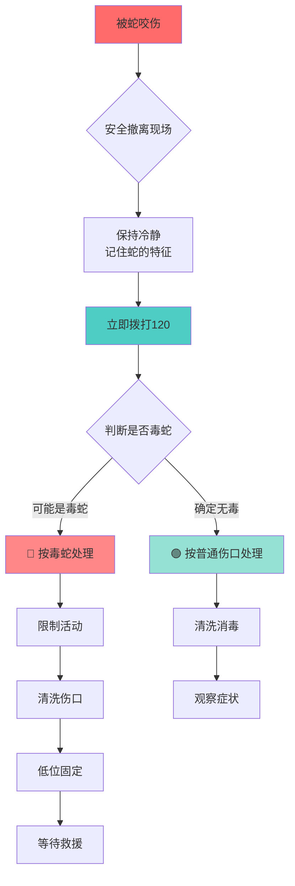

# 蛇咬伤处理 🐍

<div class="text-xl mt-8">
遇到蛇不要慌，科学处理是关键
</div>

<div class="mt-12 text-4xl" v-click>
🐍 ≠ 🎮 贪吃蛇
</div>

<div class="text-lg mt-6 text-gray-600" v-click>
现实中的蛇可不会吃了你就变长...
</div>

---
layout: default
---

# 首先：如何识别毒蛇 🔍

<div class="grid grid-cols-2 gap-8 mt-6">

<div v-click>
<div class="p-5 bg-red-50 rounded-lg border-2 border-red-300">

### ☠️ 毒蛇特征

<v-clicks depth="2">

- 🔺 **头部呈三角形**（像个倒三角饭团）
- 👁️ **瞳孔呈椭圆形**（像猫眼）
- 🌈 **颜色鲜艳**（大自然的警告色）
- ⚡ **动作敏捷**（跑得快的不一定是好蛇）
- 🦷 **咬痕深且明显**（2个深牙印）

</v-clicks>

<div class="mt-4 p-3 bg-red-100 rounded text-sm" v-click>
⚠️ <span v-mark.circle.red>中国常见毒蛇：眼镜蛇、竹叶青、五步蛇、蝮蛇</span>
</div>

</div>
</div>

<div v-click>
<div class="p-5 bg-green-50 rounded-lg border-2 border-green-300">

### ✅ 无毒蛇特征

<v-clicks depth="2">

- 🔴 **头部呈圆形或椭圆形**
- 👁️ **瞳孔呈圆形**
- 🟤 **颜色较暗淡**
- 🐌 **动作相对缓慢**
- 🦷 **咬痕浅且散**（一排小牙印）

</v-clicks>

<div class="mt-4 p-3 bg-green-100 rounded text-sm" v-click>
💡 但是！<span v-mark.underline.orange>不确定就当毒蛇处理</span>，别拿命去赌！
</div>

</div>
</div>

</div>

<div class="mt-6 text-center p-4 bg-yellow-50 rounded-lg" v-click>
<p class="text-lg">🎯 <strong>黄金法则：</strong> <span v-mark.highlight.yellow>看不清楚？那就假设它有毒！</span></p>
<p class="text-sm text-gray-600 mt-2">（不要试图成为野外生存专家，你不是贝尔·格里尔斯）</p>
</div>

---
layout: default
---

# 蛇咬伤紧急处理流程 🚨

<div class="mt-8">



</div>

---
layout: default
---

# 毒蛇咬伤处理步骤（1/3）

<div class="mt-6">

## 第一步：迅速撤离 + 冷静呼救 🏃

<v-clicks>

<div class="p-4 bg-blue-50 rounded-lg mb-4">
<strong class="text-blue-700">🏃‍♂️ 立即远离</strong>
<ul class="mt-2 space-y-1 text-sm">
<li>• 快速但<span v-mark.underline.red>不要慌乱</span>地离开蛇所在区域</li>
<li>• 防止二次攻击（蛇：我还能打十个！）</li>
<li>• 撤离到安全距离（至少 5 米外）</li>
</ul>
</div>

<div class="p-4 bg-purple-50 rounded-lg mb-4">
<strong class="text-purple-700">🧠 保持冷静</strong>
<ul class="mt-2 space-y-1 text-sm">
<li>• <span v-mark.circle.orange>深呼吸</span>，控制情绪</li>
<li>• 尽量记住蛇的<strong>外观、颜色、大小</strong></li>
<li>• 可以拍照，但<strong>别靠近</strong>！（不是自拍时间）</li>
</ul>
</div>

<div class="p-4 bg-green-50 rounded-lg">
<strong class="text-green-700">📞 立即呼救</strong>
<ul class="mt-2 space-y-1 text-sm">
<li>• 第一时间拨打 <span v-mark.highlight.red class="text-xl font-bold">120</span></li>
<li>• 说明：<strong>被蛇咬伤</strong> + 位置 + 蛇的特征</li>
<li>• 询问是否有<strong>抗蛇毒血清</strong>可用</li>
</ul>
</div>

</v-clicks>

</div>

---
layout: default
---

# 毒蛇咬伤处理步骤（2/3）

<div class="mt-6">

## 第二步：限制活动 + 清洗伤口 🚫

<div class="grid grid-cols-2 gap-6 mt-4">

<div v-click>
<div class="p-4 bg-orange-50 rounded-lg h-full">

### 🚫 限制活动

<v-clicks depth="2">

- 让伤者<span v-mark.highlight.red>立即停止活动</span>
- 受伤部位<span v-mark.underline.orange>保持低于心脏</span>
- <strong>避免跑动</strong>（加速毒液扩散）
- 解除束缚物（手表、戒指、鞋带）

</v-clicks>

<div class="mt-3 p-3 bg-white rounded text-sm" v-click>
⚠️ <strong>为什么不能动？</strong>
<p class="mt-1 text-xs">运动会加快血液循环 → 毒液扩散更快 → 你会更惨</p>
</div>

</div>
</div>

<div v-click>
<div class="p-4 bg-blue-50 rounded-lg h-full">

### 💧 清洗伤口

<v-clicks depth="2">

- 用<strong>清水或生理盐水</strong>冲洗
- 冲洗时间：<span v-mark.circle.green>15-20 分钟</span>
- 从心脏方向<strong>向外</strong>挤压（排出毒液）
- <strong class="text-red-600">不要用嘴吸</strong>！！！

</v-clicks>

<div class="mt-3 p-3 bg-white rounded text-sm" v-click>
❌ <strong>别学电影情节！</strong>
<p class="mt-1 text-xs">嘴里有伤口？恭喜你，毒液从口腔进入血液了</p>
<p class="text-xs">（而且蛇毒不好喝，相信我）</p>
</div>

</div>
</div>

</div>

</div>

---
layout: default
---

# 毒蛇咬伤处理步骤（3/3）

<div class="mt-6">

## 第三步：包扎固定 + 等待救援 🩹

<div class="grid grid-cols-2 gap-6 mt-4">

<div v-click>
<div class="p-4 bg-teal-50 rounded-lg h-full">

### 🩹 正确包扎（压迫固定法）

<v-clicks depth="2">

1. 在咬伤处<span v-mark.highlight.orange>近心端 5-10cm</span> 处包扎
2. 松紧度：<span v-mark.circle.red>能伸进一根手指</span>
3. 标记包扎时间
4. 每 <strong>15-20 分钟</strong>放松 1-2 分钟

</v-clicks>

<div class="mt-3 p-3 bg-white rounded text-sm" v-click>

<div class="mb-2">
<strong>✅ 正确示范：</strong>
</div>

```
     咬伤处
        ↓
    ----🩹---- ← 包扎位置（近心端）
        |
        💓 心脏方向
```

</div>

</div>
</div>

<div v-click>
<div class="p-4 bg-purple-50 rounded-lg h-full">

### 🏥 固定 + 等待救援

<v-clicks depth="2">

- 用<strong>夹板或硬物</strong>固定伤肢
- 保持伤肢<span v-mark.underline.green>低位</span>（低于心脏）
- <strong>不要移动伤者</strong>（等救护车）
- 持续观察生命体征

</v-clicks>

<div class="mt-3 p-3 bg-white rounded text-sm" v-click>
💡 <strong>黄金时间窗</strong>
<ul class="text-xs mt-2 space-y-1">
<li>• <span v-mark.highlight.yellow>2 小时内</span>注射抗蛇毒血清最有效</li>
<li>• 越早越好！</li>
<li>• 时间就是生命（字面意思）</li>
</ul>
</div>

</div>
</div>

</div>

</div>

---
layout: default
---

# 中毒症状判断 🩺

<div class="mt-6">

## 观察这些症状，帮助医生判断 👀

<div class="grid grid-cols-2 gap-6 mt-4">

<div v-click>
<div class="p-5 bg-red-50 rounded-lg border-2 border-red-400">

### 🔴 局部症状

<v-clicks depth="2">

- 🔴 伤口周围<span v-mark.highlight.red>红肿、剧痛</span>
- 💜 皮肤<strong>变紫变黑</strong>
- 💧 伤口<strong>流血不止</strong>或渗液
- 🦵 肢体<strong>肿胀</strong>迅速扩散
- 🔥 <strong>灼烧感</strong>或麻木

</v-clicks>

<div class="mt-3 p-3 bg-white rounded text-xs" v-click>
📍 记录症状出现的时间和进展速度，告诉医生
</div>

</div>
</div>

<div v-click>
<div class="p-5 bg-orange-50 rounded-lg border-2 border-orange-400">

### 🟠 全身症状

<v-clicks depth="2">

- 😵 <span v-mark.circle.red>头晕、恶心、呕吐</span>
- 👁️ <strong>视力模糊</strong>、复视
- 💧 <strong>大量出汗</strong>
- 😰 <strong>呼吸困难</strong>、胸闷
- 💓 心跳加快或减慢
- 😴 嗜睡、意识模糊

</v-clicks>

<div class="mt-3 p-3 bg-red-100 rounded text-xs font-bold text-red-700" v-click>
⚠️ 出现全身症状 = 危险！立即就医！
</div>

</div>
</div>

</div>

</div>

<div class="mt-6 p-4 bg-yellow-50 rounded-lg" v-click>
<p class="font-bold text-lg">⏱️ <span v-mark.highlight.orange>不同蛇毒发作时间不同</span></p>
<ul class="text-sm mt-2 space-y-1">
<li>• <strong>神经毒素</strong>（眼镜蛇、金环蛇）：30 分钟 - 2 小时</li>
<li>• <strong>血液毒素</strong>（蝮蛇、五步蛇）：几小时到 1 天</li>
<li>• <strong>混合毒素</strong>（竹叶青）：症状复杂，快慢不一</li>
</ul>
</div>

---
layout: default
---

# 蛇咬伤常见误区 ❌

<div class="text-lg mt-6">

<v-clicks>

<div class="flex items-start gap-4 mb-6 p-4 bg-red-50 rounded-lg border-2 border-red-300">
  <div class="text-5xl">❌</div>
  <div>
    <strong class="text-red-600 text-xl">误区 1：用嘴吸出毒液</strong>
    <p class="text-sm mt-2">❌ <strong>非常危险！</strong></p>
    <ul class="text-sm mt-2 space-y-1">
    <li>• 口腔黏膜、牙龈破损 → 毒液进入血液</li>
    <li>• 蛇毒可能通过消化道吸收</li>
    <li>• <span v-mark.underline.green>正确做法：清水冲洗 + 挤压排毒</span></li>
    </ul>
  </div>
</div>

<div class="flex items-start gap-4 mb-6 p-4 bg-red-50 rounded-lg border-2 border-red-300">
  <div class="text-5xl">❌</div>
  <div>
    <strong class="text-red-600 text-xl">误区 2：包扎过紧或用止血带</strong>
    <p class="text-sm mt-2">❌ <strong>会导致肢体坏死！</strong></p>
    <ul class="text-sm mt-2 space-y-1">
    <li>• 完全阻断血流 → 组织缺血缺氧</li>
    <li>• 可能需要截肢</li>
    <li>• <span v-mark.underline.green>正确做法：松紧适度，能伸进一根手指</span></li>
    </ul>
  </div>
</div>

<div class="flex items-start gap-4 mb-6 p-4 bg-red-50 rounded-lg border-2 border-red-300">
  <div class="text-5xl">❌</div>
  <div>
    <strong class="text-red-600 text-xl">误区 3：用刀割开伤口放血</strong>
    <p class="text-sm mt-2">❌ <strong>加重伤情！</strong></p>
    <ul class="text-sm mt-2 space-y-1">
    <li>• 增加感染风险</li>
    <li>• 加剧出血</li>
    <li>• 损伤神经和血管</li>
    <li>• <span v-mark.underline.green>正确做法：温和挤压，不要切割</span></li>
    </ul>
  </div>
</div>

</v-clicks>

</div>

---
layout: default
---

# 更多误区（续）⚠️

<div class="text-lg mt-6">

<v-clicks>

<div class="flex items-start gap-4 mb-6 p-4 bg-red-50 rounded-lg border-2 border-red-300">
  <div class="text-5xl">❌</div>
  <div>
    <strong class="text-red-600 text-xl">误区 4：涂抹草药、药酒</strong>
    <p class="text-sm mt-2">❌ <strong>延误治疗时间！</strong></p>
    <ul class="text-sm mt-2 space-y-1">
    <li>• "民间偏方"无科学依据</li>
    <li>• 可能引起过敏或感染</li>
    <li>• <span v-mark.underline.green>正确做法：只用清水清洗，等待专业救治</span></li>
    </ul>
  </div>
</div>

<div class="flex items-start gap-4 mb-6 p-4 bg-red-50 rounded-lg border-2 border-red-300">
  <div class="text-5xl">❌</div>
  <div>
    <strong class="text-red-600 text-xl">误区 5："五步蛇咬了走五步就死"</strong>
    <p class="text-sm mt-2">❌ <strong>谣言！但也别掉以轻心</strong></p>
    <ul class="text-sm mt-2 space-y-1">
    <li>• 毒性虽强，但没这么夸张</li>
    <li>• 及时救治，生存率很高</li>
    <li>• <span v-mark.underline.green class="font-bold">关键：2 小时内注射抗蛇毒血清</span></li>
    </ul>
  </div>
</div>

<div class="flex items-start gap-4 mb-6 p-4 bg-red-50 rounded-lg border-2 border-red-300">
  <div class="text-5xl">❌</div>
  <div>
    <strong class="text-red-600 text-xl">误区 6：大量饮酒"解毒"</strong>
    <p class="text-sm mt-2">❌ <strong>加速毒液扩散！</strong></p>
    <ul class="text-sm mt-2 space-y-1">
    <li>• 酒精加快血液循环 → 毒液扩散更快</li>
    <li>• 影响医生判断和用药</li>
    <li>• <span v-mark.underline.green>正确做法：保持清醒，不要饮酒</span></li>
    </ul>
  </div>
</div>

</v-clicks>

</div>

---
layout: center
class: text-center
---

# 蛇咬伤处理口诀 📝

<div class="text-3xl mt-12 space-y-6 leading-relaxed">

<div v-click>
<span v-mark.circle.red>远</span> 离 蛇 窝 勿 靠 近
</div>

<div v-click>
<span v-mark.circle.orange>呼</span> 救 一 二 零 最 先
</div>

<div v-click>
<span v-mark.circle.yellow>限</span> 制 活 动 稳 心 跳
</div>

<div v-click>
<span v-mark.circle.green>清</span> 水 冲 洗 挤 毒 液
</div>

<div v-click>
<span v-mark.circle.blue>包</span> 扎 固 定 莫 过 紧
</div>

<div v-click>
<span v-mark.circle.purple>速</span> 送 医 院 打 血 清
</div>

</div>

<div class="mt-12 p-6 bg-gradient-to-r from-red-50 to-orange-50 rounded-lg" v-click>
  <p class="text-2xl font-bold text-red-600">
    ⏱️ 黄金 2 小时！越快越好！
  </p>
</div>

---
layout: default
---

# 预防蛇咬伤 🛡️

<div class="grid grid-cols-2 gap-6 mt-6">

<div v-click>
<div class="p-5 bg-green-50 rounded-lg h-full">

### 🏞️ 野外活动防护

<v-clicks depth="2">

- 👢 穿<strong>高帮鞋</strong>和<strong>长裤</strong>
- 🥾 厚底防刺鞋
- 🧤 使用<strong>登山杖</strong>探路（打草惊蛇）
- 🔦 夜间用<strong>手电筒</strong>照明
- 🚫 不要<strong>随意翻石头</strong>或伸手进洞
- 🎒 带上<strong>急救包</strong>

</v-clicks>

<div class="mt-4 p-3 bg-white rounded text-sm" v-click>
💡 <span v-mark.highlight.green>"打草惊蛇"</span> 不是成语，是求生技能！
</div>

</div>
</div>

<div v-click>
<div class="p-5 bg-blue-50 rounded-lg h-full">

### 🏡 居家/露营防护

<v-clicks depth="2">

- 🏕️ 帐篷拉链<strong>完全闭合</strong>
- 🔍 睡前<strong>检查睡袋</strong>和鞋子
- 🌳 避免在<strong>草丛、乱石堆</strong>附近扎营
- 🔥 营地周围用<strong>雄黄、硫磺</strong>驱蛇
- 🚪 保持<strong>门窗关闭</strong>
- 🧹 定期<strong>清理杂物</strong>

</v-clicks>

<div class="mt-4 p-3 bg-white rounded text-sm" v-click>
⚠️ 蛇喜欢<span v-mark.circle.orange>阴凉潮湿</span>的地方，小心！
</div>

</div>
</div>

</div>

<div class="mt-6 p-5 bg-yellow-50 rounded-lg" v-click>

### 🐍 遇到蛇怎么办？

<div class="grid grid-cols-3 gap-4 mt-4 text-center">

<div class="p-3 bg-white rounded">
<div class="text-4xl mb-2">🧍</div>
<strong>保持静止</strong>
<p class="text-xs mt-1">不要突然移动</p>
</div>

<div class="p-3 bg-white rounded">
<div class="text-4xl mb-2">🚶‍♂️</div>
<strong>缓慢后退</strong>
<p class="text-xs mt-1">给蛇留出逃跑空间</p>
</div>

<div class="p-3 bg-white rounded">
<div class="text-4xl mb-2">🙅</div>
<strong>不要招惹</strong>
<p class="text-xs mt-1">别拍照、别追赶</p>
</div>

</div>

</div>

---
layout: center
class: text-center
---

# 重点总结 ⭐

<div class="text-lg mt-8 space-y-4">

<v-clicks>

<div class="p-4 bg-red-50 rounded-lg">
<strong class="text-red-600">🚨 第一时间：</strong> 远离蛇 + 拨打 120
</div>

<div class="p-4 bg-orange-50 rounded-lg">
<strong class="text-orange-600">🚫 限制活动：</strong> 不跑动、不饮酒，保持伤肢低位
</div>

<div class="p-4 bg-yellow-50 rounded-lg">
<strong class="text-yellow-600">💧 清洗伤口：</strong> 清水冲洗 15-20 分钟，温和挤压排毒
</div>

<div class="p-4 bg-green-50 rounded-lg">
<strong class="text-green-600">🩹 包扎固定：</strong> 松紧适度，能伸进一根手指
</div>

<div class="p-4 bg-blue-50 rounded-lg">
<strong class="text-blue-600">⏱️ 黄金时间：</strong> 2 小时内注射抗蛇毒血清最有效
</div>

<div class="p-4 bg-purple-50 rounded-lg">
<strong class="text-purple-600">❌ 禁止操作：</strong> 不用嘴吸、不切割、不涂药酒
</div>

</v-clicks>

</div>

<div class="mt-10 p-6 bg-gradient-to-r from-red-100 to-orange-100 rounded-xl" v-click>
  <p class="text-2xl font-bold text-red-700">
    🐍 预防 > 治疗！做好防护最重要！
  </p>
  <p class="text-sm mt-3 text-gray-700">
    野外活动时刻警惕，遇到蛇不要慌，科学处理保平安
  </p>
</div>

---
layout: center
class: text-center
---

# 最后一句话 💬

<div class="text-4xl mt-16" v-click>
🐍 蛇：我也不想咬你
</div>

<div class="text-2xl mt-8 text-gray-600" v-click>
你不招惹我，我不招惹你
</div>

<div class="text-xl mt-12 p-6 bg-yellow-50 rounded-lg inline-block" v-click>
<p class="font-bold">🎯 记住：</p>
<p class="mt-3">
<span v-mark.highlight.red class="text-2xl">遇蛇绕行</span>，
<span v-mark.highlight.orange class="text-2xl">被咬冷静</span>，
<span v-mark.highlight.green class="text-2xl">2 小时内送医</span>
</p>
</div>

<div class="mt-12 text-sm text-gray-500" v-click>
（蛇：你好好的，我也好好的，大家都好好的）
</div>
